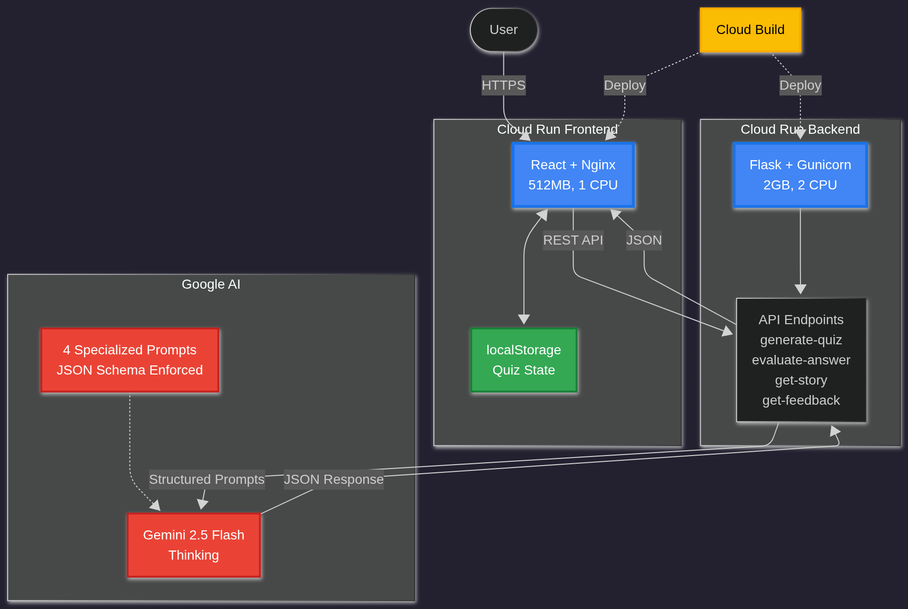

# AI Study Coach

> Transform any study material into personalized, adaptive quizzes powered by Google Gemini 2.5 Flash

A production-ready microservices application built for the **Google Cloud Run Hackathon 2025**, demonstrating serverless architecture, intelligent prompt engineering, and cost-efficient scaling.

[](https://cloud.google.com/run)
[](https://ai.google.dev/)
[](https://react.dev/)
[](https://flask.palletsprojects.com/)

[Video Walkthrough](https://youtu.be/804uznQGtJc)

***

## Features

- **Smart Quiz Generation** - Paste any text and get personalized questions across 4 types: MCQ, True/False, Fill-in-the-blank, Short Answer
- **AI-Powered Evaluation** - Intelligent grading with partial credit, detailed feedback, and improvement suggestions
- **Story Mode** - ELI5 explanations for difficult concepts using analogies and simple language
- **Performance Analytics** - Identifies weak topics, strong areas, and common misconceptions with personalized study recommendations
- **Bookmark System** - Save difficult questions for later review
- **Persistent State** - Quiz progress saved locally—resume anytime without login
- **Serverless Architecture** - Zero idle cost with request-based autoscaling

---

## Architecture

Built as **two independent Cloud Run services** with complete separation of concerns:



| Service | Tech Stack | Configuration |
|-----------|-----------|-----------|
| **Frontend** | React + Vite + Nginx | 512MB, 1 vCPU | Min instances: 0 |
| **Backend** | Flask + Gunicorn | 2GB, 2 vCPU | Min instances: 0 |
| **AI Engine** | Gemini 2.5 Flash | API-based | 4 specialized prompts |

### Frontend Service (`quiz-frontend`)

**Purpose**: Responsive UI and client-side state management
- React 18 with Vite for fast builds
- Tailwind CSS for styling
- localStorage for quiz state persistence
- Multi-stage Docker build (optimized image size)
- CORS-enabled for backend communication
- Completely stateless (no server-side sessions)

***

### Backend Service (`quiz-backend`)

**Purpose**: Secure AI integration and prompt orchestration
- Python 3.11 with Flask framework
- Gunicorn WSGI server (production-ready)
- Custom JSON extraction/repair logic

**API Endpoints**:

```
POST /api/generate-quiz
Body: { extractedSource: { text, title }, config: { questionCount, difficulty, questionTypes } }
Returns: Structured quiz JSON with questions, options, answers, explanations

POST /api/evaluate-subjective
Body: { question: {...}, userAnswer: "string" }
Returns: Evaluation with isCorrect, feedback, explanation

POST /api/get-story
Body: { extractedSource: { text, title }, config: { storyStyle } }
Returns: ELI5 explanation with analogies in Markdown

POST /api/get-feedback
Body: { quizMeta: {...}, stats: { correct, incorrect, weakTopics, ... } }
Returns: Performance analysis and personalized study recommendations

GET /api/health
Returns: { status: "ok", model_configured: true }
```

***

### AI Integration (Google Gemini)

**Model**: `gemini-2.5-flash` via AI Studio API

**Four Specialized Prompts** (all with JSON schema enforcement):

1. **[Quiz Generator](https://aistudio.google.com/app/prompts/1Pn4t0chQJwKPhpwNcjnj6n_REqmDoGJZ)** - Transforms input text into structured questions with answers, explanations, and metadata
2. **[Subjective Evaluator](https://aistudio.google.com/app/prompts/1CuWNEVTdZJYDCtHWnEHrn7sTDWvRhMdv)** - Analyzes answers with partial credit and constructive feedback
3. **[Story Explainer](https://aistudio.google.com/app/prompts/17a3owZtp5HglZ-OdCaO1G560DkUDdkND)** - Breaks down concepts into ELI5 explanations with analogies
4. **[Feedback Generator](https://aistudio.google.com/app/prompts/1PFOhcyBXwY7TcqHcAhyJPSPrwznVokmW)** - Analyzes stats to provide personalized study recommendations

---

## Technology Stack

### Project Structure

```
ai-study-coach/
├── backend
│   ├── app.py
│   ├── Dockerfile
│   └── requirements.txt
├── frontend
│   ├── Dockerfile
│   ├── index.html
│   ├── public
│   ├── src
│   │   ├── components
│   │   ├── contexts
│   │   ├── hooks
│   │   ├── main.jsx
│   │   ├── pages
│   │   ├── services
│   │   └── utils
│   └── vite.config.js
├── LICENCE
└── README.md
```

***

## Getting Started

### Prerequisites

- **Google Cloud Account** with billing enabled
- **Gemini API Key** from [AI Studio](https://aistudio.google.com/apikey)
- **Docker** (for local development)
- **Node.js 20+** and **Python 3.11+**
- **gcloud CLI** installed and configured

***

### Local Development

#### Backend Setup

```bash
cd backend

# Create virtual environment
python -m venv venv
source venv/bin/activate

# Install dependencies
pip install -r requirements.txt

# Configure environment
echo "GEMINI_API_KEY=your_actual_key_here" > .env

# Run development server
python app.py
# Backend runs at http://localhost:5000
```

#### Frontend Setup

```bash
cd frontend

# Install dependencies
npm install

# Configure environment
echo "VITE_API_URL=http://localhost:5000/api" > .env.production

# Run development server
npm run dev
# Frontend runs at http://localhost:5173
```

***


## Configuration

### Environment Variables

**Backend** (`.env`):
```bash
GEMINI_API_KEY=your_gemini_api_key_here
PORT=8080 
```

**Frontend** (`.env.production`):
```bash
VITE_API_URL=https://your-backend-service.run.app/api
```

### Cloud Run Settings

**Backend Service**:
- Memory: 2GB
- CPU: 2 vCPU
- Timeout: 300s
- Concurrency: 160

**Frontend Service**:
- Memory: 512MB
- CPU: 1 vCPU
- Timeout: 60s
- Concurrency: 80

***

## Testing

### Backend API Testing

```bash
# Health check
curl https://quiz-backend-xxxxx.run.app/api/health

# Generate quiz
curl -X POST https://quiz-backend-xxxxx.run.app/api/generate-quiz \
  -H "Content-Type: application/json" \
  -d '{
    "extractedSource": {
      "text": "Photosynthesis is the process by which plants convert light energy into chemical energy.",
      "title": "Photosynthesis"
    },
    "config": {
      "questionCount": 5,
      "difficulty": "medium",
      "questionTypes": ["MCQ", "Short Answer"]
    }
  }'
```

### Frontend Local Testing

```bash
cd frontend
npm run build    # Test production build
npm run preview  # Preview production build locally
```

***

## Key Technical Achievements

- **Production-ready microservices** - Independent services scaling 0→100+ instances
- **Robust prompt engineering** - 4 specialized prompts with JSON schema enforcement
- **Stateless architecture** - Client-side state management for infinite scalability
- **Defensive AI parsing** - Custom extraction logic handles unreliable model output

---

## License

MIT License - feel free to use this project as a reference for your own Cloud Run applications.

***

